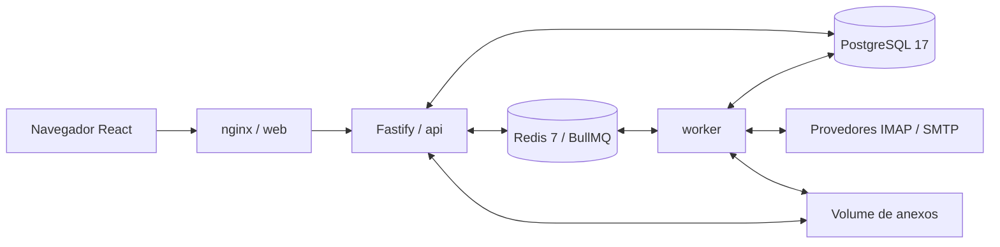

# Arquitetura do APMail

O PostgreSQL é a fonte da verdade. Redis organiza execução e tempo real; jobs perdidos serão reconstruídos a partir do banco. Pacotes shared não usam módulos Node; db é exclusivo do servidor.

As sete filas usam prefixo `apmail`: mailbox-sync, mailbox-connection, outbox-send, mail-actions, rules-apply, system-email e maintenance. As salas Socket.IO serão autorizadas por sessão e recurso: user, tenant, mailbox, thread e chat.

Migrations SQL são aplicadas em transações com lock exclusivo e checksum imutável. Segredos locais não entram no Git. A infraestrutura nova usa recursos Docker exclusivos.
